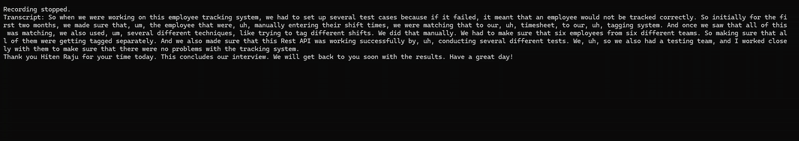

# 🤖 AI Interview System

An **intelligent interview platform** that conducts automated job interviews using AI. The system analyzes resumes, asks relevant questions, and provides detailed feedback with scoring.

---

## 🎥 Demo Video

*(Click the preview to watch the full video)*

## ✨ Features

- **Resume Analysis**: Upload your PDF resume and get key highlights extracted automatically  
- **Personalized Questions**: AI generates interview questions based on your resume and the job description  
- **Voice Interaction**: Speak your answers naturally – the system will transcribe and analyze them  
- **Real-time Chat**: Clean chat interface showing the entire conversation flow  
- **Intelligent Scoring**: Get detailed feedback and scores for each answer  
- **Complete Evaluation**: Receive an overall interview score and comprehensive report  

---

## 🚀 How It Works

### 1️⃣ Setup
- Upload your resume (PDF format)  
- Paste the job description you're applying for  
- Select Maximum number of Questions (Optional)  
- Select AI Interviewer Voice (Optional)  
- Click **"Submit"** to process your information  

### 2️⃣ Interview Process
- Click **"Start Interview"** to begin  
- The AI interviewer greets you and asks the first question  
- Listen to each question (text-to-speech enabled)  
- Record your answer using the audio recorder **(Chrome browser required)**  
- The system transcribes and analyzes your response  
- Get the next question based on your previous answers  

### 3️⃣ Results
- Complete the selected number of interview questions  
- Receive detailed feedback for each answer  
- Get an overall interview score out of 10  
- Review full chat history and evaluation report  

---

## 🎯 What Makes It Special

- **Adaptive Questioning**: Each question builds on your previous answers  
- **Natural Conversation**: Feels like talking to a real interviewer  
- **Detailed Feedback**: Understand strengths and areas for improvement  
- **Professional Interface**: Modern, chat-based design  
- **Complete Documentation**: Full transcript and scoring breakdown  

---

## 📋 Requirements

- Internet connection for AI processing  
- Microphone access for recording answers  
- PDF resume file  
- Job description text  
- **LLM API key** for AI processing  
  - Supported Models (LiteLLM): [LiteLLM Providers](https://docs.litellm.ai/docs/providers) (Change `LLM_MODEL` in `.env`)  
  - Free Experimental Model: [MistralAI](https://mistral.ai/)  
  - Note: If using OpenAI or another provider, update the environment variable from `MISTRAL_API_KEY` to `OPENAI_API_KEY` per LiteLLM guidelines.  
- **Speechmatics API key** for speech-to-text  
  - [Speechmatics Platform](https://www.speechmatics.com/)  

---

## 🎨 Interface

The system features a modern chat interface similar to ChatGPT:

- **AI Interviewer** messages appear on the left  
- **Your responses** appear on the right (transcribed from audio)  
- **Progress tracker** shows which question you’re on  
- **Audio recorder** for easy voice input  

---

## 📊 Scoring System

Each answer receives:
- Individual score (0–10)  
- Detailed written feedback  
- Suggestions for improvement  

Final results include:
- Overall interview score  
- Question-by-question breakdown  
- Complete conversation history  
- Personalized recommendations  

---

## 🛠️ Run Locally

1. Clone the repository  
2. Create a virtual environment  
3. Install dependencies inside the virtual environment  
4. Add environment variables like API keys  
5. Run the application  

---

## 🔄 Multiple Interviews

- Take multiple practice interviews  
- Try different job descriptions  
- Track your improvement over time  
- Perfect your interview skills  

---

## 💡 Tips for Best Results

- Speak clearly when recording answers  
- Provide detailed, specific responses  
- Take your time – there’s no rush  
- Treat it like a real interview  
- Review feedback to improve  

---

🚀 *Ready to ace your next interview? Upload your resume and get started!*  

